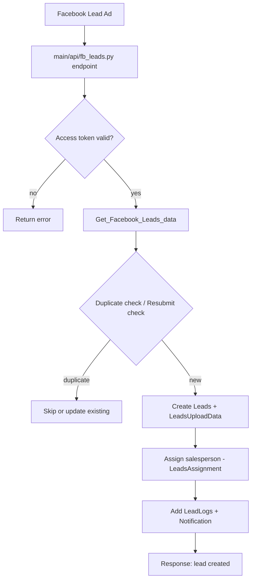
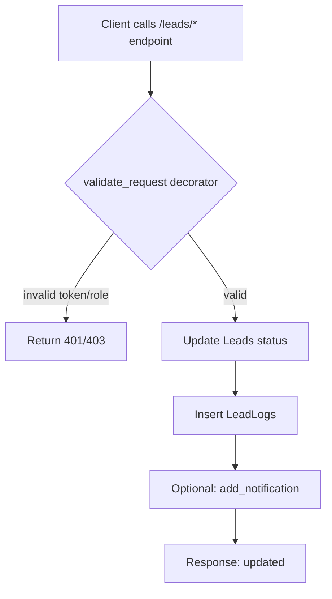
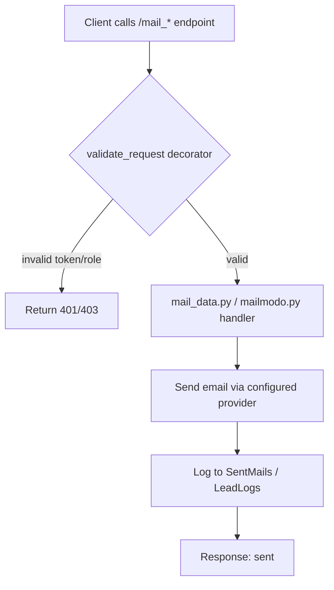

# How iPerform Works

## Understanding the System

This guide explains how iPerform functions behind the scenes - but in plain English, without technical jargon.

## The Big Picture

iPerform is a Flask backend built around Blueprints in [main/api](../main/api) with SQLAlchemy models in [main/model](../main/model). Requests are validated by decorators and helpers, then data is stored in MySQL and related systems (e.g., ClickHouse for reporting utilities).

## How Information Flows

### Example 1: When a New Lead Comes from Facebook

1.  Facebook lead data is fetched in `fb_leads.py`.
2.  The access token is validated before fetching details.
3.  Duplicate/resubmit checks run before inserting records.
4.  New leads are saved to `Leads` and related tables.
5.  Assignment is created via `LeadsAssignment` and notifications are logged.

### Example 2: When You Update a Lead's Status

1.  `validate_request` checks token and role before updates.
2.  Lead status changes are persisted to `Leads`.
3.  Activity is recorded in `LeadLogs`, with optional notifications.

### Example 3: When You Send an Email

1.  Email endpoints validate access using `validate_request`.
2.  Send logic is handled in `mail_data.py` or `mailmodo.py`.
3.  Send results are logged in `SentMails` or `LeadLogs`.

## System Components (Code-based)

### 1. Authentication and Authorization

- Auth endpoints are in [main/api/login.py](../main/api/login.py).
- Access checks use `validate_request` and related decorators in [main/utills/decorator.py](../main/utills/decorator.py).
- Token and role checks gate API access.

### 2. Lead Management

- Lead CRUD endpoints live in [main/api/leads.py](../main/api/leads.py).
- Facebook ingestion is handled in [main/api/fb_leads.py](../main/api/fb_leads.py).
- Lead history is captured in `LeadLogs` and related models.

### 3. Communication

- WhatsApp endpoints and utilities are in [main/api/whatsapp.py](../main/api/whatsapp.py) and [main/api/whatsapp_new.py](../main/api/whatsapp_new.py).
- Email utilities are in [main/api/mail_data.py](../main/api/mail_data.py) and [main/api/mailmodo.py](../main/api/mailmodo.py).

### 4. Ticketing

- Ticket endpoints live in [main/api/ticketing_system.py](../main/api/ticketing_system.py).
- Status and communication models include `Tickets`, `TicketStatus`, and `TicketCommunication`.

### 5. Reporting

- Reports are built in [main/api/report.py](../main/api/report.py) and [main/api/custom_reports.py](../main/api/custom_reports.py).
- Some workflows use ClickHouse utilities in [main/utills/helper.py](../main/utills/helper.py).

## Data Organization

- Models are defined under [main/model](../main/model) and mapped via SQLAlchemy.
- Core entities include `Leads`, `LeadLogs`, `Tickets`, `TicketStatus`, `WhatsappTemplate`, and `SentMails`.

## Integration Points

- **Facebook**: Lead capture in [main/api/fb_leads.py](../main/api/fb_leads.py).
- **WhatsApp**: Messaging workflows in [main/api/whatsapp.py](../main/api/whatsapp.py) and [main/api/whatsapp_new.py](../main/api/whatsapp_new.py).
- **Email (AWS SES)**: Email utilities configured in [config.py](../config.py).
- **OpenAI**: Client configured in [__init__.py](__init__.py).
- **ClickHouse**: Analytics helpers in [main/utills/helper.py](../main/utills/helper.py).

## Security & Privacy

- Role and token checks are enforced by decorators before sensitive actions.
- Activity logging is persisted in `LeadLogs` and related tables.

## System Reliability

- Production monitoring integrates Sentry when `IPERFORM_ENV=pro` in [__init__.py](__init__.py).

## Scalability

- The app can be run with multiple workers (e.g., via gunicorn) and scaled at the infrastructure level.

## Performance Notes

- Query performance and scaling are handled through database tuning and deployment configuration.

---

**Previous**: [← Installation Guide](02_INSTALLATION_GUIDE.md)  
**Next**: [Data & Settings →](05_CONFIGURATION.md)
