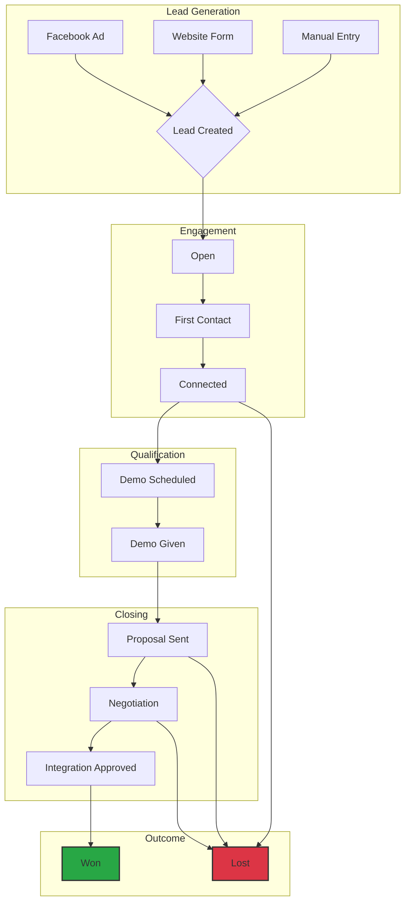
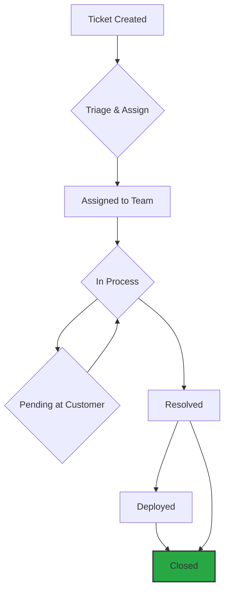

# Business Workflows & Processes

## Understanding How Work Flows Through iPerform

This guide explains the key business processes and workflows in plain language - how things actually work day-to-day.

## Lead Lifecycle - The Complete Journey

This flowchart shows the path a lead takes from creation to close.

### Stage 1: Lead Capture

**How Leads Enter the System**:

**Facebook Ad Form Filled** (Automatic):
1. Customer sees your Facebook ad
2. Clicks and fills out the form
3. Within seconds, lead appears in iPerform
4. System automatically assigns to available salesperson
5. Salesperson gets notification on phone
6. Ready to contact!

**Website Form Submission**:
1. Visitor fills form on your website
2. Form data sent to iPerform
3. Lead created automatically
4. Assigned based on rules (territory, product interest, etc.)
5. Notification sent

**Manual Entry by Salesperson**:
1. Salesperson meets potential customer
2. Logs into iPerform
3. Clicks "Add New Lead"
4. Enters all customer information
5. Lead created and assigned to them

**Partner Referral**:
1. Partner company submits lead
2. Lead credited to partner
3. Assigned to managing salesperson
4. Both notified

**Excel Bulk Upload**:
1. You have list of 100+ leads
2. Fill Excel template
3. Upload to iPerform
4. System processes all at once
5. Summary report shows success/failures

### Stage 2: First Contact

**What Happens Next**:

1. **Salesperson Reviews Lead**:
   - Checks company details
   - Reviews source (Facebook, website, etc.)
   - Reads any initial notes
   - Checks contact information

2. **Makes First Contact** (Call/Email/WhatsApp):
   - Introduces company and product
   - Understands customer needs
   - Gauges interest level
   - Schedules demo if interested

3. **Updates Lead Status**:
   - Changes from "Open" to "Connected"
   - Adds detailed notes about conversation
   - Schedules follow-up activity
   - Sets reminder for next step

4. **System Actions** (Automatic):
   - Logs the activity
   - Notifies manager of progress
   - Updates reports
   - Creates follow-up task

### Stage 3: Demo & Presentation

**The Demo Process**:

1. **Demo Scheduled**:
   - Salesperson books demo appointment
   - Updates status to "Demo Scheduled"
   - Sends calendar invite to customer
   - Prepares demo materials
   - System reminds salesperson before demo time

2. **Demo Given**:
   - Conducts product demonstration
   - Answers customer questions
   - Gathers feedback
   - Discusses pricing
   - Status updated to "Demo Given"

3. **After Demo**:
   - Salesperson adds detailed notes:
     * What features interested customer most
     * Questions asked
     * Concerns raised
     * Budget discussed
     * Decision timeline
   - Schedules next steps
   - May offer trial if applicable

### Stage 4: Proposal & Negotiation

**Creating & Sending Proposal**:

1. **Proposal Preparation**:
   - Salesperson creates customized proposal
   - Includes pricing for customer needs
   - Adds relevant features
   - Upload to iPerform

2. **Proposal Sent**:
   - Email with proposal attached
   - Status updated to "Proposal Sent"
   - Email tracking shows when opened
   - Follow-up scheduled for 2-3 days later

3. **Negotiations**:
   - Customer asks questions
   - Pricing adjustments if needed
   - Feature clarifications
   - All communications logged
   - Status may move to "On Hold" if customer needs time

4. **Closing Signals**:
   - Customer agrees to terms
   - Requests contract
   - Asks about onboarding
   - Status updated to "Integration Approved"

### Stage 5: Winning the Deal

**Conversion Process**:

1. **Agreement Finalized**:
   - Contract signed
   - Payment confirmed
   - Onboarding scheduled
   - Status updated to "Won" 🎉

2. **System Actions**:
   - Moves from "Lead" to "Customer"
   - Notifies relevant teams
   - Triggers customer success workflow
   - Celebrates the win (notification to team)
   - Updates revenue reports

3. **Handoff to Customer Success**:
   - Customer success team notified
   - All lead notes and history transferred
   - Onboarding begins
   - Regular check-ins scheduled

### Alternate Outcome: Lost Deals

**When Deal Doesn't Close**:

1. **Lost Status**:
   - Status changed to "Lost"
   - **Reason required** (why did we lose?):
     * Price too high
     * Went with competitor
     * Budget constraints
     * Timing not right
     * Feature gaps
     * Other reason

2. **Learning & Improvement**:
   - Lost reasons analyzed in reports
   - Patterns identified
   - Process improvements made
   - Team training adjusted

3. **Future Opportunities**:
   - Lead not deleted (stays in system)
   - Can be reactivated later
   - Nurture campaigns possible
   - Re-engagement tracking

## Ticketing Workflow - Customer Support

This flowchart shows how a support ticket is handled from creation to resolution.

### When a Ticket is Created

**Trigger Points**:
- Customer reports a problem
- Salesperson encounters issue
- Technical team discovers bug
- Feature request from customer
- Scheduled maintenance needed

**Ticket Creation**:
1. Someone clicks "Create Ticket"
2. Links to customer account
3. Describes the issue
4. Sets priority (Normal/High/Critical)
5. Categorizes issue type
6. Ticket saved with unique ID

### Ticket Assignment

**Automatic Routing**:
- **Sync Issues** → Technical Integration Team
- **Product Bugs** → Development Team
- **Feature Requests** → Product Team
- **Data Problems** → Data Team
- **General** → Customer Success Team

**Manual Assignment**:
- Manager reviews ticket
- Assigns to specific team member
- Based on expertise and availability
- Person notified immediately

### Working on Tickets

**Technical Team Process**:

1. **Ticket Assigned** to them:
   - Notification received
   - Status: "Assigned"
   
2. **Begin Investigation**:
   - Update status to "In Process"
   - Add comment: "Investigating the issue"
   - May ask customer for more info
   - If waiting: Status → "Pending At Customer"

3. **Finding Solution**:
   - Document findings in comments
   - Collaborate with team
   - Test solution
   - Document resolution steps

4. **Resolution**:
   - Update status to "Resolved"
   - Add resolution notes
   - Customer informed
   - May require deployment

5. **Deployment** (if code changes):
   - Code deployed to production
   - Status updated to "Deployed"
   - Customer notified
   - Verification scheduled

6. **Closure**:
   - Customer confirms it's fixed
   - Status updated to "Closed"
   - Satisfaction tracked
   - Ticket archived after 30 days

### Communication Throughout

**Internal Updates**:
- Team members add comments
- Progress visible to all
- Questions answered
- Collaboration seamless

**Customer Updates**:
- Automatic notifications on status changes
- Regular progress updates
- Resolution notification
- Feedback requested

## Follow-Up Activity Workflow

### Setting Up Follow-Ups

**When You Schedule**:
1. Select a lead/customer
2. Click "Schedule Follow-Up"
3. Choose date and time
4. Select activity type:
   - **Call**: Phone conversation
   - **Email**: Send email
   - **WhatsApp**: WhatsApp message
   - **Meeting**: In-person or video meeting
5. Add notes about what to discuss
6. Save

**What System Does**:
- Creates follow-up record
- Sets reminder
- Shows on your calendar
- Appears on daily task list
- Sends notification at right time

### Following Up

**Day of Follow-Up**:
1. **Morning**: Check dashboard for today's tasks
2. **See Follow-Up Listed**: Customer name, company, what to discuss
3. **Take Action**: Make the call/send email/send WhatsApp
4. **After Completing**:
   - Mark as "Complete"
   - Add notes about outcome
   - Schedule next follow-up if needed
   - Update lead status if appropriate

**If You Can't Complete**:
- Reschedule for another date
- System updates reminder
- Reason logged for tracking

### Auto-Reminders

**System Reminds You**:
- 1 hour before scheduled time
- At scheduled time
- 1 day after if not marked complete

**Reminder Appears**:
- Push notification on phone
- Email reminder
- Shows in app with alert badge
- Added to daily task list

## Email Campaign Workflow

### Planning Campaign

**Campaign Setup**:
1. **Define Goal**: Demo invites, offer announcement, newsletter
2. **Select Audience**:
   - All open leads
   - Specific status (e.g., "Demo Given")
   - Specific industry
   - Custom filter
3. **Choose/Create Template**
4. **Personalize**: Automatically inserts name, company
5. **Schedule Send Time**: Best time for engagement

### Sending Campaign

**Process**:
1. Review campaign details
2. Click "Send Campaign"
3. System processes:
   - Queues all emails
   - Sends in batches (prevents spam detection)
   - Inserts personalization for each
   - Tracks each email individually

### Monitoring Results

**Track Performance**:
- **Sent**: How many emails sent
- **Delivered**: Successfully delivered
- **Opened**: Who opened the email
- **Clicked**: Who clicked links
- **Bounced**: Failed deliveries
- **Unsubscribed**: Opted out

**Take Action Based on Results**:
- **High Opens**: Content resonated, do more
- **Low Opens**: Subject line needs work
- **Clicked Links**: Interested, follow up personally
- **Unsubscribed**: Respect preference, remove from future campaigns

## WhatsApp Campaign Workflow

### Compliance First

**WhatsApp Requirements**:
- Must use approved templates
- Can't send promotional messages freely
- Need customer opt-in
- Business hours only

**Template Approval Process**:
1. Write message template
2. Submit to WhatsApp for approval
3. Wait 2-3 days for review
4. Once approved, can use anytime

### Running Campaign

**Campaign Setup**:
1. Select approved template
2. Choose recipients
3. Variables fill automatically (name, company, etc.)
4. Schedule send time
5. Review and confirm

**Sending**:
- System sends to WhatsApp Business API
- Messages delivered
- Delivery status tracked
- Responses logged

**Best Practices**:
- Don't overuse (respect customers)
- Send during business hours only
- Provide value in every message
- Make unsubscribing easy

## Partner Workflow

### Partner Submits Lead

**Partner's Process**:
1. Partner finds potential customer
2. Logs into their portal
3. Submits lead information
4. Gets confirmation

**Your System**:
1. Lead appears in iPerform
2. Attributed to partner
3. Assigned to managing salesperson
4. Partner and salesperson both notified
5. Partner can track progress

### Managing Partner Relationship

**Regular Activities**:
- Weekly/monthly partner reports
- Commission tracking
- Performance reviews
- Training and enablement
- Collaborative sales calls

**Partner Dashboard** (Partner's View):
- Their submitted leads
- Status of each lead
- Won/Lost outcomes
- Commission earned
- Performance metrics

## Reporting Workflow

### Daily/Weekly Reports

**Automated Reports**:
- Generated automatically
- Emailed to recipients
- Show key metrics:
  * Leads added
  * Demos conducted
  * Proposals sent
  * Deals won
  * Revenue generated

**Who Gets What**:
- **Salespersons**: Own performance
- **Managers**: Team performance
- **Executives**: Company-wide metrics

### Custom Analysis

**When You Need Specific Insights**:
1. Go to Reports section
2. Select "Custom Report"
3. Choose:
   - Date range
   - Metrics to include
   - Filters (source, status, person, etc.)
   - Grouping (by month, by person, etc.)
4. Generate report
5. Export to Excel if needed
6. Save for future use

### Data-Driven Decisions

**Using Reports**:
- **Identify Top Performers**: Recognize and reward
- **Find Bottlenecks**: Where deals get stuck
- **Optimize Sources**: Focus on best lead sources
- **Improve Conversion**: Analyze why deals are won/lost
- **Resource Allocation**: Assign resources where needed
- **Forecast Revenue**: Predict based on pipeline

## Best Practices for Each Workflow

### Lead Management
✓ Update status after every interaction  
✓ Add detailed notes (future you will thank you)  
✓ Set follow-ups immediately  
✓ Don't let leads go cold  
✓ Check dashboard daily  

### Customer Support
✓ Respond to tickets within 2 hours  
✓ Keep customers updated on progress  
✓ Document solutions for future reference  
✓ Close tickets only when customer confirms  
✓ Learn from recurring issues  

### Communication
✓ Personalize every message  
✓ Track engagement (opens, clicks)  
✓ Follow up on engaged leads  
✓ Respect unsubscribe requests  
✓ Test different message times  

### Reporting
✓ Review reports weekly  
✓ Share insights with team  
✓ Act on data, not gut feelings  
✓ Track trends over time  
✓ Celebrate wins, learn from losses  

---

**Previous**: [← Available Features](06_API_REFERENCE.md)  
**Next**: [External Integrations →](08_INTEGRATIONS.md)
