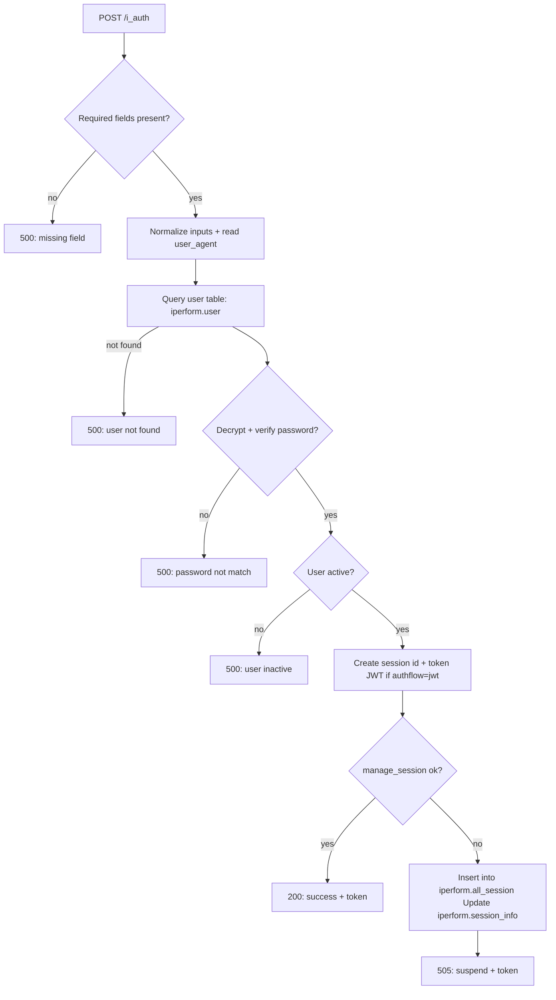
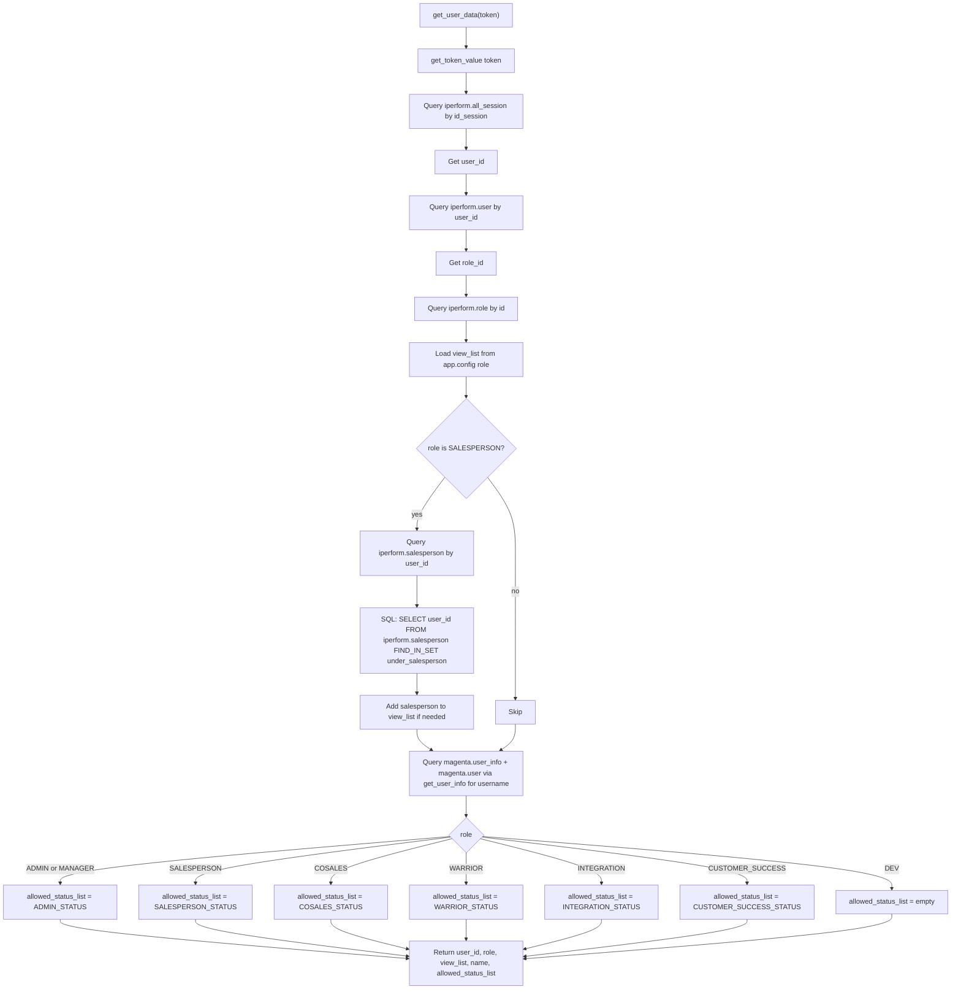
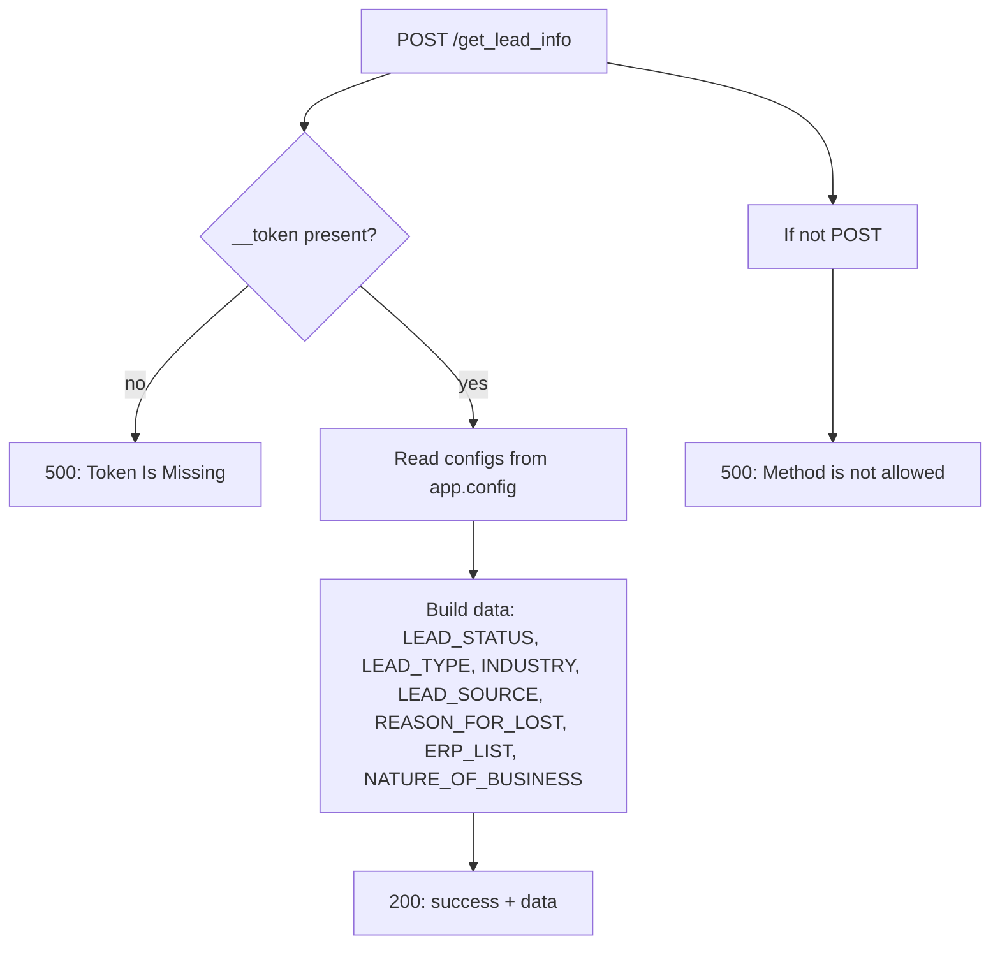
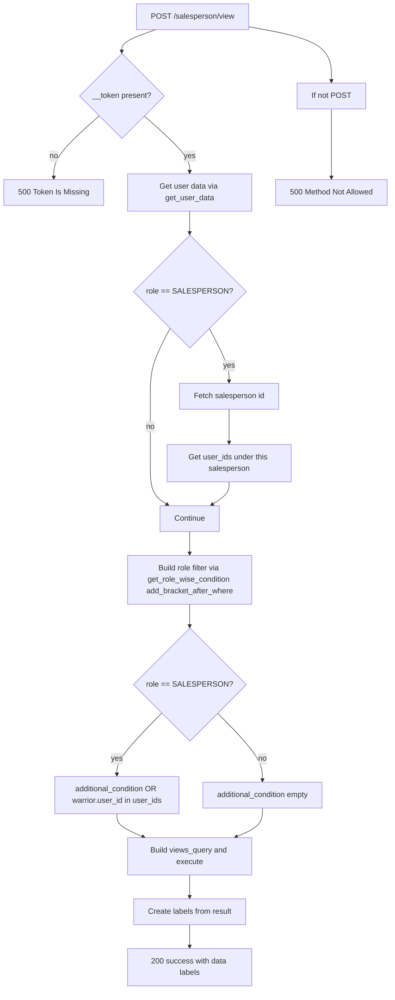
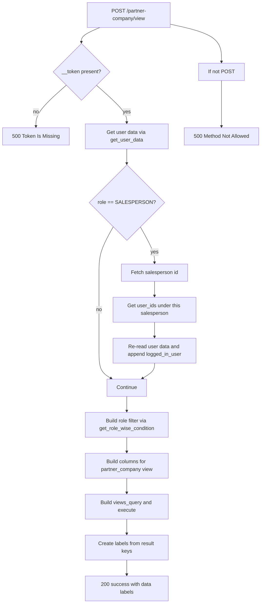
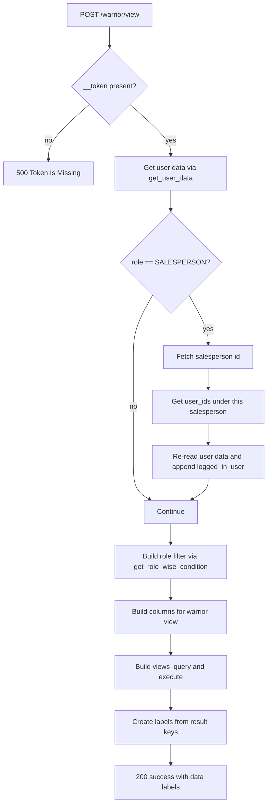
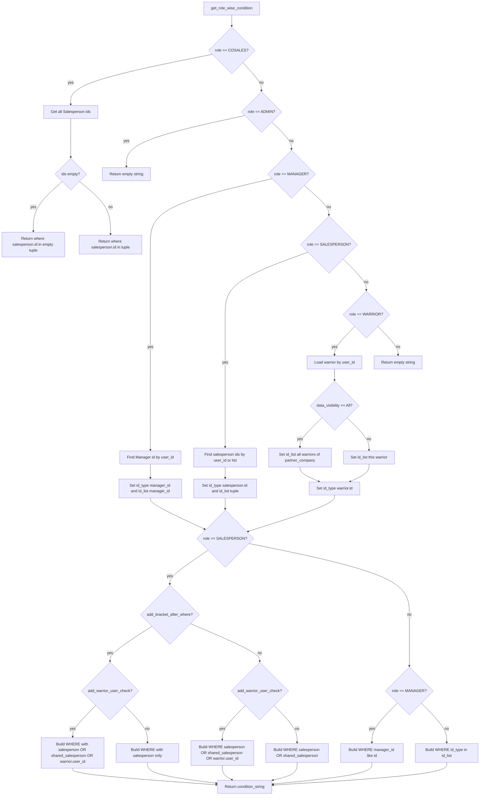

# Application Workflow

## Core Business Workflows

This document describes the primary workflows in iPerform, including the actual flow diagrams found in the project.

---

## 1. Authentication Workflow

### **iPerform Internal Authentication (i_auth)**



**Sequence**:
1. Client submits username/password to `/i_auth`
2. Server validates required fields
3. Normalize email, read user agent for device tracking
4. Query `iperform.user` table by username or email
5. If user not found → Return 500 error
6. Decrypt password and compare with stored hash
7. If mismatch → Return 500 error
8. Check user active status
9. If inactive → Return 500 error
10. Generate JWT token with user_id, email, role_id
11. Create session record in `iperform.all_session`
12. Return token to client

**Key Tables**:
- `iperform.user`: User credentials and basic info
- `iperform.all_session`: Active sessions
- `iperform.session_info`: Session statistics

---

### **Get User Data (Helper Function)**



**Sequence**:
1. Extract token from request header
2. Decode JWT token to get session ID
3. Query `iperform.all_session` table
4. Get `user_id` from session
5. Query `iperform.user` table to get role_id
6. Query `iperform.role` table to get base view permissions
7. Load view_list from app.config based on role
8. If SALESPERSON: Query `iperform.salesperson` to find warrior IDs
9. Get user information from `magenta.user_info` and `magenta.user`
10. Based on role, determine allowed statuses:
    - ADMIN/MANAGER: All statuses
    - SALESPERSON: Lead-specific statuses
    - WARRIOR: Follow-up/action statuses
    - COSALES: Shared lead statuses
    - CUSTOMER_SUCCESS: Support-related statuses
11. Return user context object

**Key Tables**:
- `iperform.all_session`: Session records
- `iperform.user`: User info
- `iperform.role`: Role permissions
- `iperform.salesperson`: Salesperson hierarchy
- `magenta.user_info`: User details

---

## 2. Lead Management Workflow

### **Get Lead Information**



**Purpose**: Provide UI with dropdown/select options for lead creation

**Data Returned**:
- Lead Status Options
- Lead Types
- Industries
- Lead Sources (Facebook, LinkedIn, Manual, API, etc.)
- Reasons for Lost (Budget, Timeline, Competition, etc.)
- ERP System List
- Nature of Business (B2B, B2C, etc.)

**Key Source**: `config.py` contains all these constants

---

### **Create Lead Workflow**

**Request**: POST `/leads` with lead data

**Validation Steps**:
1. Validate required fields (firm_name, company_id)
2. Validate email format
3. Check if lead already exists (deduplication)
4. Validate phone number format
5. Check user authorization (can user create leads?)

**Database Operations**:
```sql
INSERT INTO iperform.leads (
    firm_name, company_id, client_email_id,
    status, warrior_id, created_by, created_on
) VALUES (...);

-- Create initial status record
INSERT INTO iperform.lead_status (
    lead_id, status, changed_by, changed_on
) VALUES (LAST_INSERT_ID(), 'New', ?, NOW());

-- Log activity
INSERT INTO iperform.lead_logs (
    lead_id, activity_type, activity_details, logged_by, logged_on
) VALUES (LAST_INSERT_ID(), 'created', '...', ?, NOW());
```

**Post-Creation Actions**:
1. Insert lead into `iperform.leads`
2. Create initial `lead_status` record
3. Log activity in `iperform.lead_logs`
4. Send notification to assigned salesperson (if assigned)
5. Replicate to ClickHouse asynchronously
6. Trigger webhooks for external systems

**Response**: 201 Created with lead object including ID

---

## 3. Lead View Workflows

### **Salesperson View Workflow**



**Purpose**: Get salesperson-specific view of leads

**Execution Steps**:
1. Validate token and get user data
2. If role = SALESPERSON:
   - Get salesperson ID from `iperform.salesperson`
   - Get all warrior IDs under this salesperson
3. Build SQL WHERE clause using `get_role_wise_condition`:
   - Filter by salesperson_id = X
   - OR shared_salesperson includes X
   - OR warrior.user_id in warrior_ids
4. Execute query against `iperform.leads` view
5. Extract column labels and create response
6. Return 200 with salesperson view data

---

### **Partner Company View Workflow**



**Purpose**: Get partner company view of assigned leads

**Key Difference from Salesperson**:
- Partner companies only see leads explicitly assigned to them
- Filter by `partner_company_id` and assignment status
- More restricted access than salesperson view

---

### **Warrior View Workflow**



**Purpose**: Get warrior-specific view of assigned leads

**Access Control**:
- Warriors only see leads assigned to them (by ID)
- Cannot see other warriors' leads
- Limited to follow-up and communication actions

---

## 4. Role-wise Access Control Workflow



**Purpose**: Build dynamic SQL WHERE clause based on user role

**Role-specific Filters**:
- **ADMIN**: No filter (all data)
- **MANAGER**: Filter by manager_id
- **SALESPERSON**: Filter by salesperson_id OR shared_salesperson OR warrior
- **COSALES**: Filter by all salesperson IDs
- **WARRIOR**: Filter by warrior_id (self only)
- **CUSTOMER_SUCCESS**: Filter by support-assigned leads
- **INTEGRATION**: No direct UI access
- **DEV**: All data (development)

---

## 5. Report Generation Workflow

### **Typical Report Workflow**

```
User Request Report
        ↓
Validate Parameters (date range, company_id, filters)
        ↓
Build SQL Query from template or user input
        ↓
Check query against security rules
        ↓
Query appropriate database (MySQL or ClickHouse)
        ↓
Aggregate/Transform results
        ↓
Format as JSON/CSV/PDF
        ↓
Cache results for 30 minutes
        ↓
Return to user
        ↓
Schedule email delivery (if requested)
```

### **Activity Report Workflow**

```
GET /activity-report?user_id=5&from_date=2024-01-01&to_date=2024-02-05
        ↓
Get user data (get_user_data)
        ↓
Validate date range
        ↓
Build SQL:
  SELECT 
    COUNT(DISTINCT CASE WHEN activity_type='call' THEN id END) as calls,
    COUNT(DISTINCT CASE WHEN activity_type='email' THEN id END) as emails,
    COUNT(DISTINCT CASE WHEN activity_type='followup' THEN id END) as followups
  FROM lead_logs
  WHERE user_id = ? AND logged_on BETWEEN ? AND ?
        ↓
Execute against ClickHouse (iperform_helper.lead_logs)
        ↓
Return aggregated metrics
```

---

## 6. ERP Integration Workflow

### **Data Sync Process**

```
Manual Trigger: POST /integration/sync
        ↓
Validate company_id and ERP credentials
        ↓
Retrieve ERP connection from extractor.credentials
        ↓
Connect to ERP system using stored credentials
        ↓
Execute extraction queries:
  - Query customer master data
  - Query transaction/invoice data
  - Query pending orders
  - Query outstanding reports
        ↓
Transform data:
  - Map ERP fields to iPerform schema
  - Validate data types
  - Handle NULL values
  - Detect duplicates
        ↓
Upsert into iPerform leads:
  - INSERT if new customer
  - UPDATE if customer exists
  - Skip if unchanged
        ↓
Log sync results in extractor.sync_history
        ↓
Trigger webhooks for external systems
        ↓
Send completion notification to admin
```

---

## 7. Communication Workflow

### **Email Sending Workflow**

```
Client: POST /send-email
  {
    lead_id: 100,
    template_id: 5,
    variables: {name: "John", demo_date: "2024-02-10"}
  }
        ↓
Get email template from magenta.email_template
        ↓
Substitute variables in template
        ↓
Get recipient email from leads table
        ↓
Validate email format
        ↓
Send via AWS SES or SMTP
        ↓
Log email in iperform_mail table with status='sent'
        ↓
Enable email tracking via unique pixel
        ↓
Return email_id to client
        ↓
Listen for bounce/open/click webhooks
        ↓
Update email status (opened, clicked, bounced)
```

### **Follow-up Scheduling Workflow**

```
Client: POST /schedule-followup
  {
    lead_id: 100,
    followup_date: "2024-02-10T14:00:00Z",
    description: "Call proposal discussion"
  }
        ↓
Get lead details
        ↓
Insert into followup_activity table
        ↓
Schedule reminder notification 1 day before
        ↓
Send confirmation to assigned user
        ↓
Add to calendar/task management system
        ↓
On followup_date:
  - Send reminder notification
  - Mark as due in dashboard
  - Allow marking as completed
```

---

## 8. Lead Assignment Workflow

### **Automatic Assignment**

```
New Lead Created
        ↓
Check auto-assignment rules configured for company
        ↓
Rules evaluate:
  - Territory/Geography
  - Salesperson availability
  - Current workload
  - Lead source
  - Industry specialization
        ↓
Select best-match salesperson
        ↓
Update leads table: warrior_id = selected_id
        ↓
Send notification to assigned salesperson
        ↓
Log assignment in lead_logs
        ↓
Trigger webhook for external systems
```

### **Manual Assignment**

```
Manager: PUT /leads/100 {warrior_id: 5}
        ↓
Validate warrior exists and is active
        ↓
Update leads.warrior_id = 5
        ↓
Create activity log entry
        ↓
Notify previous owner (if exists)
        ↓
Notify new owner
        ↓
Update any dependent records
```

---

## 9. Complete Lead Lifecycle

```
LEAD LIFECYCLE:

New Lead Entry
  ├─ Manual entry
  ├─ Facebook Lead Ads
  ├─ CSV Import
  ├─ REST API
  └─ Webhook

    ↓ (Status: New)

Lead Qualification
  ├─ Review company info
  ├─ Check ERP integration
  ├─ Verify contact details
  └─ Mark qualified/unqualified

    ↓ (Status: Qualified)

Demo Scheduling
  ├─ Contact lead
  ├─ Schedule demo
  ├─ Send calendar invite
  └─ Track follow-ups

    ↓ (Status: Demo)

Proposal Creation
  ├─ Create proposal document
  ├─ Send via email with tracking
  ├─ Track opening/download
  └─ Schedule follow-up

    ↓ (Status: Proposal)

Trial/POC Phase
  ├─ Set up trial account
  ├─ Provide training
  ├─ Track usage metrics
  └─ Collect feedback

    ↓ (Status: Trial)

Conversion Decision
  ├─ Negotiate terms
  ├─ Create contract
  ├─ Complete paperwork

    ↓ (Status: WON or LOST)

If WON:
  ├─ Create customer record
  ├─ Set up account
  ├─ Schedule onboarding
  └─ Transfer to customer success

If LOST:
  ├─ Record reason
  ├─ Archive lead
  ├─ Set follow-up (nurture)
  └─ Log feedback

Archive
  └─ Mark is_deleted = 1
```

---

## 10. Dashboard Real-time Update Workflow

```
User opens dashboard
        ↓
Request current metrics:
  - Active leads
  - Recent activity
  - Performance metrics
  - Pending follow-ups
        ↓
Query from MySQL for real-time data
        ↓
Query from ClickHouse for analytics
        ↓
Aggregate and format response
        ↓
Send to client with WebSocket connection
        ↓
Listen for data changes:
  - New leads created
  - Status changes
  - Activity logged
  - Follow-ups completed
        ↓
Push updates to client via WebSocket
        ↓
Update dashboard in real-time
```

---

## Summary

iPerform workflows are designed with:
- ✅ Clear separation of concerns
- ✅ Role-based access control at every step
- ✅ Comprehensive audit trails
- ✅ Integration points for external systems
- ✅ Real-time notifications
- ✅ Error handling and recovery
- ✅ Scalable database queries
- ✅ Security validation at each step
